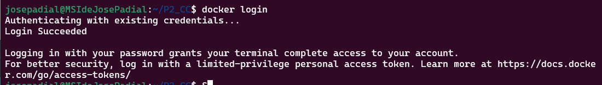
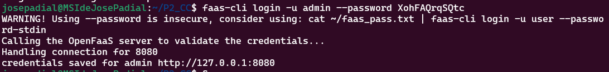
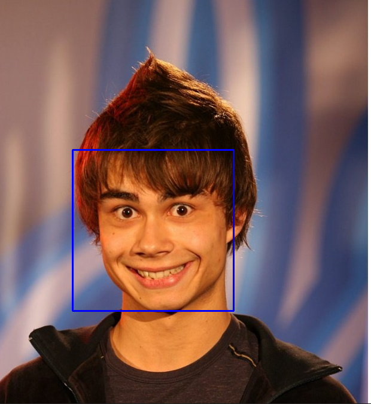

# Práctica 2: Implementación del reconocimiento facial mediante funciones como servicio

<!-- TOC -->
* [La idea principal](#la-idea-principal)
* [Requisitos de instalación](#requisitos-de-instalación)
  * [Docker](#docker)
  * [OpenFaaS](#openfaas)
* [Creación de la nueva función](#creación-de-la-nueva-función)
* [Pruebas realizadas](#pruebas-realizadas)
<!-- TOC -->

## La idea principal
En un escenario real, se propondría una arquitectura en cloud con los siguientes elementos:
* Capture / recopile una imagen (por ejemplo, de una URL) como entrada a la función.
* La función debe detectar las caras que aparecen
* La función debe devolver la imagen con las caras detectadas enmarcadas en un rectángulo


## Requisitos de instalación
* Instalar Kubernetes con Docker Desktop para Windows
* OpenFaaS sobre Kubernetes. Instrucciones detalladas disponibles en la [sesión 7](https://github.com/ccano/cc2223/tree/main/session7)
* Postman

### Docker
Iniciar sesión en Docker mediante 
```` commandline
docker login
````



### OpenFaaS
```` commandline
faas-cli login -u admin --password
````



## Creación de la nueva función
En mi caso no puedo utilizar el comando:
```` commandline
faas-cli up -f facesdetection-python.yml
````
He de hacer la nueva función de la siguiente forma:
```` commandline
sudo faas-cli build -f facesdetection-python.yml
````
```` commandline
faas-cli push -f facesdetection-python.yml
````
```` commandline
faas-cli deploy -f facesdetection-python.yml
````

## Pruebas realizadas
Para comprobar el correcto funcionamiento necesitaremos la URL de una imagen y una aplicación que nos permita realizar un 
POST, yo he utilizado Postman pero el propio Visual Studio se puede utilizar. Tenemos que hacer los siguientes pasos:
* **URL:** http://127.0.0.1:8080/function/facesdetection-python
* **Body/RAW:** La URL de la imagen

Le he pasado la siguiente imagen:


Y el resultado ha sido:

